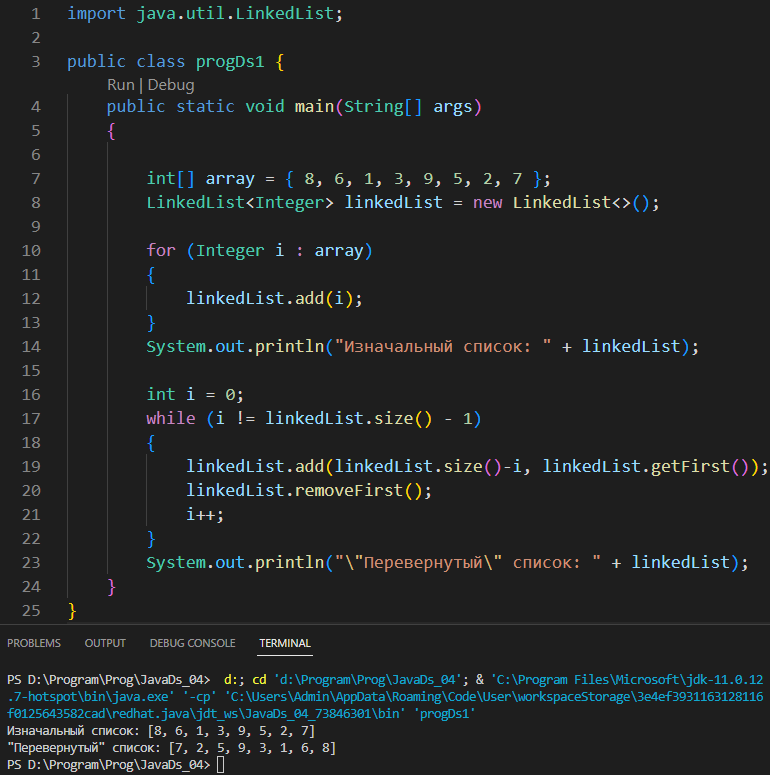
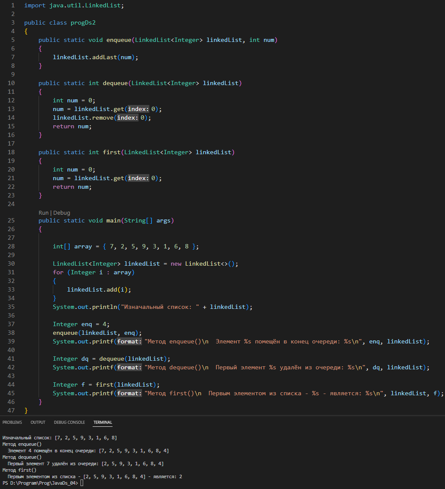

# Урок 4. Хранение и обработка данных ч1: приоритетные коллекции

## Задание 1
### Пусть дан LinkedList с несколькими элементами. Реализуйте метод, который вернет “перевернутый” список.

## Задание 2
### Реализуйте очередь с помощью LinkedList со следующими методами: enqueue() - помещает элемент в конец очереди, dequeue() - возвращает первый элемент из очереди и удаляет его, first() - возвращает первый элемент из очереди, не удаляя.
